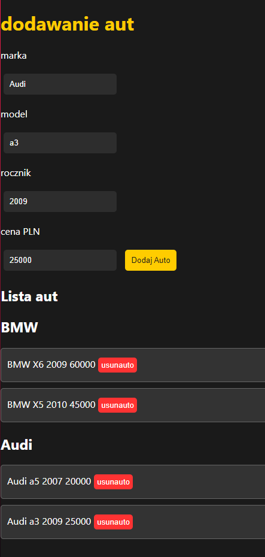

# Car Management System

This simple web application allows users to manage a list of cars, categorized by their brands. Users can add new cars, and each car is associated with a brand. Cars and brands can be removed individually.

## Features

- Add new cars with details such as brand, model, year, and price.
- Cars are categorized by brand for easy navigation.
- Remove individual cars and their associated brand if no cars are left for that brand.
- User-friendly interface with a "delete" button for each car.

## How it works

- The application uses HTML, CSS, and JavaScript.
- Cars are dynamically added to the page and categorized by brand.
- The code ensures that brand divs are created only when a new brand is encountered.

## Contributing

Contributions are welcome! If you'd like to contribute to the project, please follow these steps:

1. Fork the repository.
2. Create a new branch for your feature or bug fix.
3. Make your changes and commit them with clear and concise messages.
4. Push your changes to your fork.
5. Submit a pull request.

## Screenshot

